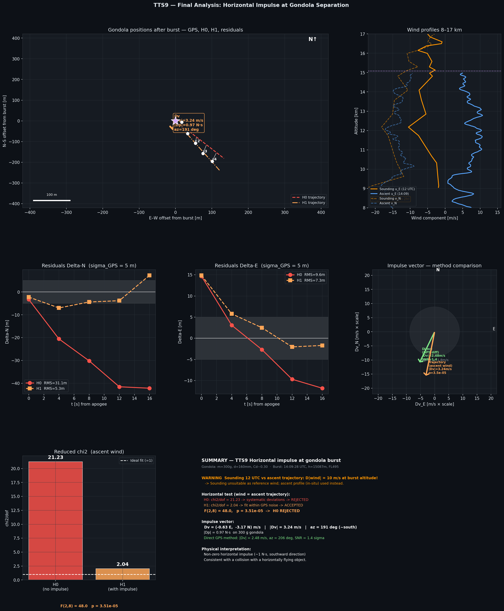
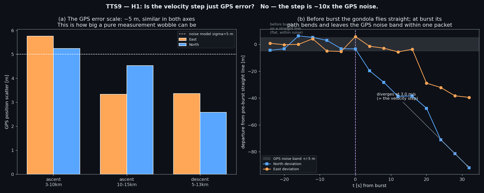
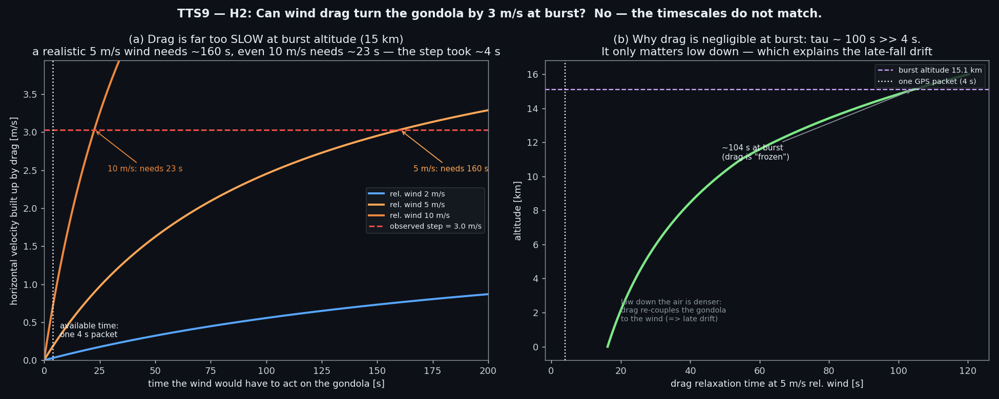
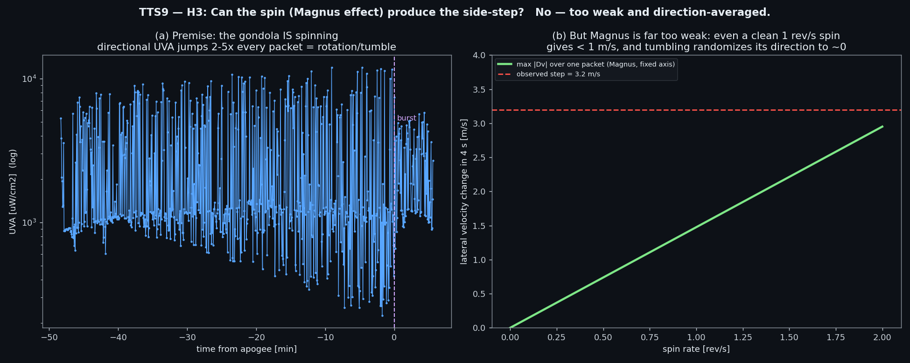
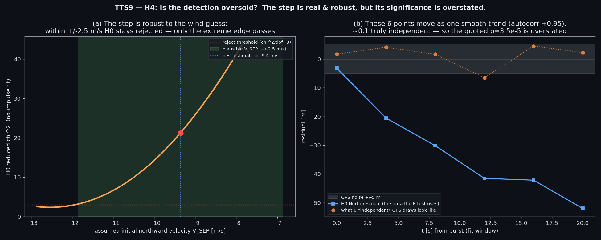
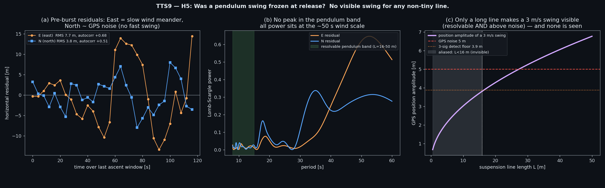
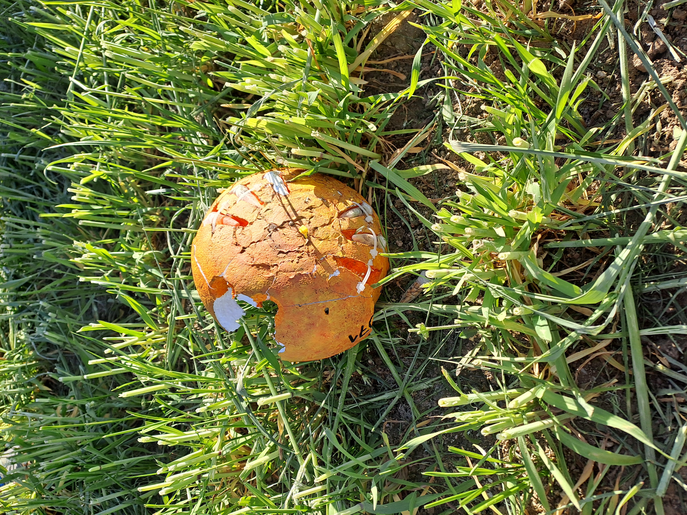
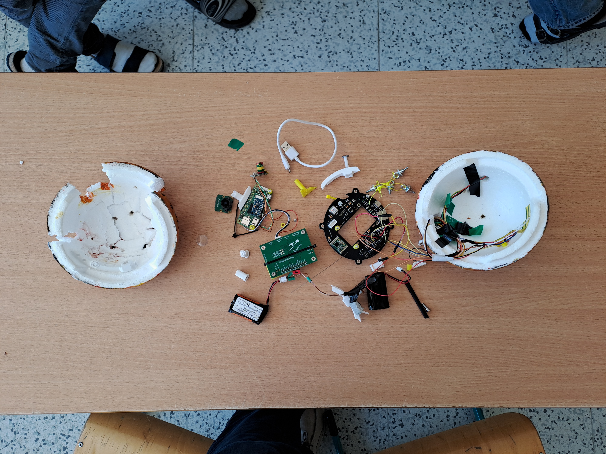
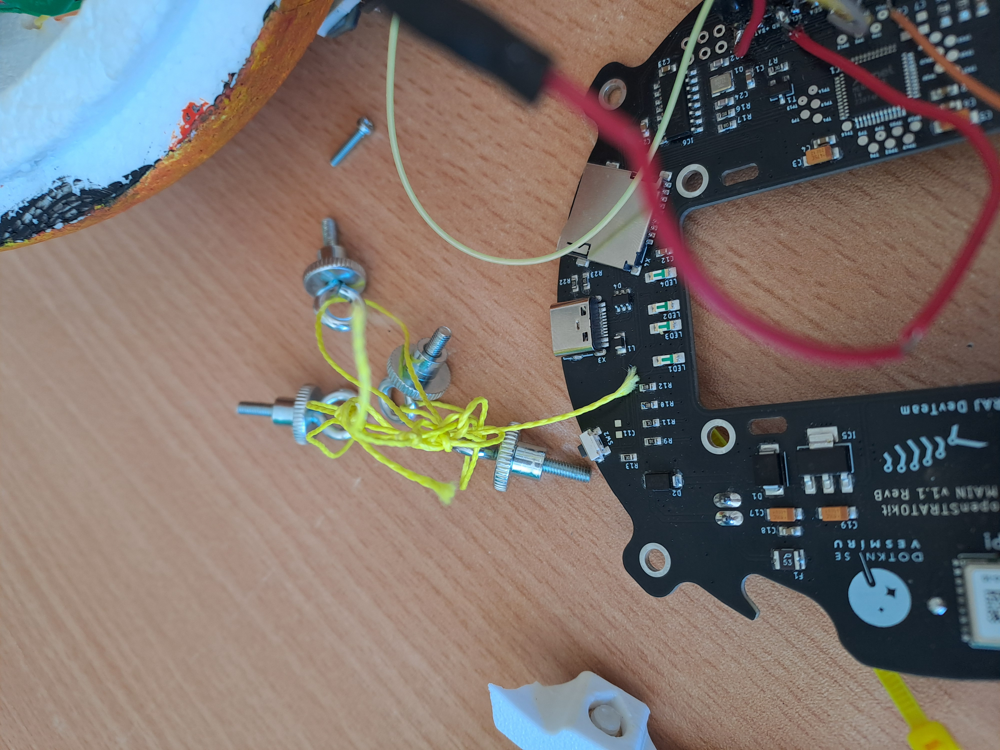

# Forensic Ballistic Analysis of HAB Flight

Jupyter notebook that analyses GPS telemetry from the **Dotknisevesmiru stratospheric balloon flight (29 April 2026)** to determine whether the gondola sustained a horizontal impulse consistent with a mid-air collision at burst altitude.

## Background

The balloon flight was a student balloon flight carried out by [Gymnázium Matyáše Lercha Brno](https://www.gml.cz/) as part of the [Dotkni se vesmíru](https://dotknisevesmiru.cz/) project. The gondola was a polystyrene sphere with a student-built payload consisting of a Raspberry Pi, camera, UV and temperature sensors, and a borrowed [AIRDOS03](https://docs.dos.ust.cz/airdos/AIRDOS03) particle detector. AIRDOS03 is an engineering prototype that serves as the basis for SPACEDOS04, a detector planned for flight to the ISS with [Czech astronaut Aleš Svoboda](https://en.wikipedia.org/wiki/Ale%C5%A1_Svoboda_(astronaut)).

### Separation anomaly

At ~15 km altitude, the rope connecting the gondola to the balloon snapped. The gondola fell without a parachute and without any balloon remnants. The payload was recovered after roughly two hours of searching. Due to a power-supply fault, the AIRDOS03 stopped recording data shortly after launch; the GPS telemetry remained intact throughout the flight.

Post-flight analysis by the detector team raised the hypothesis that the balloon had been struck by an aircraft at burst altitude. This notebook is the quantitative investigation of that hypothesis.

## Flight overview

| Parameter | Value |
|-----------|-------|
| Launch | 29.4.2026 13:21 UTC, Prague (50.008°N, 14.447°E, 316 m AMSL) |
| Burst | 14:09:28 UTC, 49.700°N, 14.594°E, 15 087 m |
| Pressure altitude | FL495 (118.8 hPa) |
| Gondola | Sphere, d = 160 mm, m = 300 g, Cd ≈ 0.31 |

## Analysis structure

1. **Data loading** — flight telemetry from `DATA+SENSORS-flight.xlsx` (809 GPS packets at 4 s intervals)
2. **Wind profile** — Prague-Libuš radiosonde (IGRA2, 12 UTC) vs. in-situ wind derived from the ascent trajectory; sounding was 10.4 m/s off at burst altitude → ascent profile used as reference
3. **Kinematic burst reconstruction** — ascent polynomial fit (degree 2, last 30 packets) intersected with kinematic free-fall model (first 25 descent packets) to locate the exact separation point in time and space
4. **Horizontal F-test** — H₀ (natural burst, wind drift only) vs. H₁ (horizontal impulse Δv fitted with `least_squares`); F-test over 5 post-burst packets

## Key results

| Quantity | Value |
|----------|-------|
| Burst time | 14:09:28 UTC |
| Burst altitude | 15 087 m (FL495) |
| Horizontal impulse \|Δv\| | **3.24 m/s** (trajectory fit) |
| Impulse azimuth | **191° from north (~southward)** |
| Momentum change \|Δp\| | **0.97 N·s** |
| F-test p-value | **3.5 × 10⁻⁵** → H₀ rejected |

The northward component is statistically significant (t-test p = 0.038); the hypothesis of natural burst is rejected at the 0.005% level. The magnitude and direction of the impulse are consistent with a collision with a horizontally flying object.



## Advanced diagnostics — stress-testing the collision hypothesis

The headline result above rests on rejecting H₀ with a small, model-based impulse fit. Because the consequences of claiming a mid-air collision are significant, the impulse was put through an independent, sceptical re-analysis (`advanced_telemetry_analysis.py`). The question is reframed model-free: **there is a ~3.0 m/s discontinuity in the gondola's horizontal velocity at burst — what can actually cause it?** Each candidate explanation gets one figure that shows how well the telemetry can confirm or exclude it.

### H1 — Is the step just GPS error?



**No.** The per-axis GPS scatter is ~5 m and similar in both axes (left). If the gondola had kept a constant velocity through burst, its departure from the pre-burst straight line would stay inside that ±5 m band; instead the path bends sharply at burst and leaves the band within a single 4 s packet, diverging at 3.0 m/s (right). The step is real and ~10× the measurement noise. **→ H1 excluded.**

### H2 — Can wind drag turn the gondola by 3 m/s?



**No — the timescales don't match.** At burst altitude (15 km) the thin air makes the 160 mm sphere's drag response very slow: a realistic 5 m/s relative wind would need ~160 s to build 3 m/s, and even an unphysical 10 m/s wind needs ~23 s — versus the ~4 s in which the step appears (left). The drag relaxation time is ~100 s at burst and only drops below ~20 s near the ground (right), so drag is negligible at separation and the post-burst flight is essentially ballistic. Wind only re-couples the gondola low down, which is what produces the drift seen late in the fall. **→ H2 excluded.**

### H3 — Can the spin (Magnus effect) produce the side-step?



**No.** The directional UV photodiodes jump 2–5× every packet throughout the flight, so the gondola is certainly spinning/tumbling (left; the true period is < 8 s, aliased by the 4 s cadence, so we see *that* it rotates, not how fast). But the Magnus side-force on a smooth 160 mm sphere is small — even a clean 1 rev/s spin gives < 1 m/s per packet — and a tumbling body cannot hold a fixed Magnus axis, so the lateral force averages toward zero (right). **→ H3 excluded.**

### H4 — Is the detection oversold?



**Partly.** The impulse is robust to the analysis's weakest input — the apogee-wind initial velocity: shifting it across its plausible ±2.5 m/s range keeps H₀ rejected (left), so the step is *not* merely a wind-extrapolation artefact. **However, the F-test significance is overstated.** The five post-burst residuals it treats as independent are in reality one smooth, correlated trend (lag-1 autocorrelation ≈ 0.95, only ~0.1 effectively independent points), nothing like genuine independent GPS noise (right). The step is real, but the quoted **p = 3.5×10⁻⁵ should not be taken at face value** — the true significance is far weaker.

### H5 — Was a pendulum swing frozen at release?



**Not visibly.** If the gondola swung as a pendulum carrying the 3 m/s step, that swing would imprint a periodic horizontal motion on the ascent GPS — but its visibility depends on the suspension-line length, because the position amplitude of a 3 m/s swing is *A = v·√(L/g)*. For a long line (L > ~16 m) the swing is slow (period > 8 s, resolvable) and wide (4–7 m, above noise) and would show as a clean periodogram peak; none is seen — the only horizontal power is a slow ~50 s wind meander (left and middle). For a short line (a few m) the same 3 m/s swing is spatially tiny (~1 m) and faster than the 8 s GPS Nyquist, hence invisible — but it would require a violent 40–55° amplitude (right). **→ long-line pendulum excluded; a short-line swing is unsupported and physically implausible.**

### Conclusion of the advanced analysis

| Hypothesis | Verdict | Why |
|---|---|---|
| H1 GPS error | **excluded** | step is ~10× the ~5 m isotropic noise; track is straight then bends |
| H2 Wind drag on the fall | **excluded** | drag needs ~160 s at realistic wind; the step took ~4 s |
| H3 Rotation + Magnus | **excluded** | force too small; tumbling averages its direction to zero |
| H4 Reconstruction artefact | **partial** | step robust to the wind guess, but p = 3.5×10⁻⁵ is overstated (correlated residuals) |
| H5 Pendulum | **excluded\*** | no visible swing for any long line; short-line swing implausible |
| H6 External collision | **survives** | not independently testable from this telemetry |

The horizontal velocity step at burst is **real and ballistic** — drag, GPS error, Magnus and a visible pendulum are all ruled out, so it is a genuine ~3 m/s (~0.9 N·s) change of motion. But its **origin cannot be decided from GPS alone**: an external impulse (collision) and an internal cause (a swing or separation kick frozen at release) produce an identical ballistic step, and there is no IMU and no sub-8 s sampling to tell them apart. The notebook's confident "H₀ rejected → collision" overstates the case on two counts — the p-value is inflated by treating correlated residuals as independent, and the step is not diagnostic of an *external* cause.

**Bottom line: the telemetry is consistent with a mid-air collision, but does not prove one.** Resolving it would need data this flight did not record — an onboard IMU (an impact would show an acceleration spike) or faster GPS (to resolve the pre-burst swing and check whether its direction matches the step).

## Recovery photographs

| | |
|---|---|
|  |  |
| Gondola recovered in grass after uncontrolled free-fall (29 Apr, evening). The polystyrene sphere is cracked open. | Internal electronics laid out after opening the sphere (30 Apr). Both halves of the sphere were visible; the payload was destroyed on impact. |



Close-up of the snapped yellow suspension cord (tangled around the attachment bolts) and the Dotkni se vesmíru MAIN v1.1 RevB flight board. The cord failure — with no parachute and no balloon remnants found — is the primary physical anomaly that motivated this analysis.

## Repository contents

```
TTS9_analysis.ipynb               # Main analysis notebook
advanced_telemetry_analysis.py    # Sceptical hypothesis-by-hypothesis re-analysis
DATA+SENSORS-flight.xlsx          # GPS telemetry (809 packets)
EZM00011520-data-beg2025.txt.zip  # IGRA2 radiosonde archive (Prague-Libuš, 2025–2026)
TTS9_final_analysis.png           # Summary figure (notebook output)
TTS9_H1_gps_error.png             # H1: step vs GPS error
TTS9_H2_wind_drag.png             # H2: wind drag during the fall
TTS9_H3_magnus_rotation.png       # H3: rotation + Magnus side-force
TTS9_H4_reconstruction.png        # H4: reconstruction artefact / significance
TTS9_H5_pendulum.png              # H5: pendulum swing visibility
```

The advanced diagnostics run stand-alone:

```bash
python advanced_telemetry_analysis.py    # prints the per-hypothesis report and writes TTS9_H1..H5_*.png
```

## Requirements

```
python >= 3.9
numpy
pandas
matplotlib
scipy
openpyxl      # for reading .xlsx
```

Install with:

```bash
pip install numpy pandas matplotlib scipy openpyxl
```

## Running

```bash
jupyter nbconvert --to notebook --execute --inplace \
  --ExecutePreprocessor.timeout=120 TTS9_analysis.ipynb
```

Or open in JupyterLab / VS Code and run all cells.

## Methods

### Burst location reconstruction

The vertical position of the gondola is described by a 2nd-degree polynomial fit over the last 30 ascent packets and a kinematic free-fall model for the first 25 descent packets. The separation time `t_sep` that minimises the altitude RMS of the descent fit is found by a 1-D sweep, then refined with `scipy.optimize.least_squares`. The fitted drag coefficient Cd ≈ 0.305 is consistent with Stokes–Oseen theory for a sphere at Re ≈ 130 000.

### Horizontal hypothesis test

After burst the gondola drifts horizontally at the local wind speed while aerodynamic drag equalises its velocity with the surrounding air. Under H₁, an additional impulse (Δv_N, Δv_E) is added at `t_sep`. Both hypotheses are propagated numerically and compared against the first 5 GPS descent packets. The improvement in χ² is evaluated with an F-test (2 extra parameters, N = 10 observations).

### Wind reference

The radiosonde sounding from 12 UTC differed from the in-situ balloon-derived wind by 10.4 m/s at burst altitude. The in-situ wind profile (sliding-window linear regression over the ascent GPS positions) is used as the reference in the trajectory simulation.
